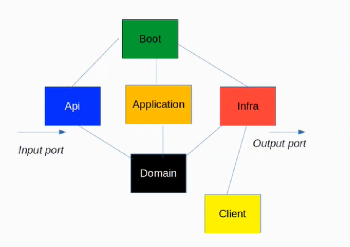
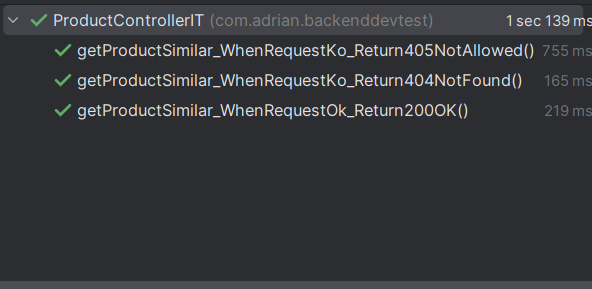

# backenddevtest

This repository contains a Spring Boot 3.0.6 application in which an implementation of [this exercise](docs/exercise.md) has been done.

For the implementation Hexagonal Architecture has been chosen with the following modules, following the recomendations of the Technology department of Inditex, and trying to follow CQRS and DDD patterns:
- **api:** implements the input ports (in this case a REST service)
- **application:** implementation of the use cases are made 
- **boot:** main module (contains also integration tests)
- **client:**: module where each client module is appended.
- **domain:** interface of the use cases and the core of the architecture
- **infrastructure:** output ports



The main technologies used for this project are:
- **Java 17**
- **OpenApi** definition and API generation (client and server)
- **Mapstruct** mapping tasks between objects
- **Lombok** automatic code generation
- **Mockito** testing purposes
- **Caffeine** for cache implementation

## Installation and execution

In order to launch the application we need to have Docker, Java and Maven installed (versions compatible with Java 17). In my case, I used IntelliJ for development.

To compile we can do the common clean install:
```bash
  mvn clean install
```
To launch de app we should first start Docker containers with the following command:
```bash
docker-compose up -d simulado influxdb grafana
```
After that we can launch it with this command:
```bash
  mvn spring-boot:run
```

It isn't neccessary any form of authentication to make requests.

## Use/Examples

To make any call we can take this as an example (all ports and context paths can be changed in application.yml file, application-test.yml for testing purposes)
```
GET http://localhost:5000/test/product/1/similar
```

# Tests

Integration tests done that ensures everything is working as expected (in addition to JUnit tests):



# Additional comments

Some configuration has been done to the rest client. Timeout of 5000ms has been set.

A context path "/test" has been set.

Also given OpenAPI specification has been modified so that it takes into account all errors returned by the service and its structure.

Integration tests are run against the same mock for simplicity and it can be changed through configuration.
