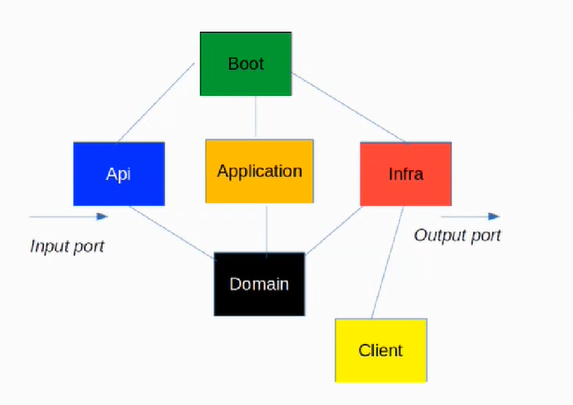
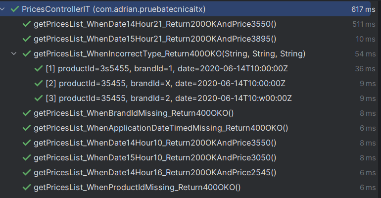

# itxtechnicaltest

Este repositorio contiene una aplicación Spring Boot 3.0.6 en la que se realiza una implementación que cumple con los requisitos definidos en: [Ejercicio](docs/exercise.txt)

Para la implementación se optó por utilizar Arquitectura Hexagonal con los siguientes módulos, siguiendo las recomendaciones de Inditex e intentando seguir CQRS y DDD:
- **api:** implementa los puertos de entrada (en este caso servicio REST)
- **application:** se definen los casos de uso
- **boot:** es el módulo principal (contiene además los tests de integración)
- **domain:** define la interfaz de la infraestructura
- **infrastructure:** se implementan los puertos de salida




Las tecnologías utilizadas para ello, a grandes rasgos serían:
- **Java 17**
- **OpenApi** para la definicion y generación de la API
- **Mapstruct** para mapear objetos
- **Lombok** para la generación automática de código
- **H2** como Base de Datos en memoria
- **Mockito** para tests

## Instalación y ejecución

Para poder lanzar el servicio debemos de disponer de Java y Maven (versiones compatibles con Java 17). Personalmente he utilizado IntelliJ para el desarrollo, y ejecución.

Para compilarlo haremos uso de
```bash
  mvn clean install
```

Para lanzarlo utilizaremos:
```bash
  mvn spring-boot:run
```

No dispone de ningún tipo de autenticación ni es necesario añadir ninguna variable de entorno.


## Uso/Ejemplos

Para realizar alguna llamada y comprobar el correcto funcionamiento de este, podemos realizar llamadas con la siguiente URL, indicandole los valores que nosotros queramos:

```
GET http://localhost:8080/test/prices/price-by-product?productId=35455&brandId=1&applicationDate=2020-06-15T16:00:00Z
```


# Tests

Resultados de los tests de integración para los casos de prueba indicados en el ejercicio: 


